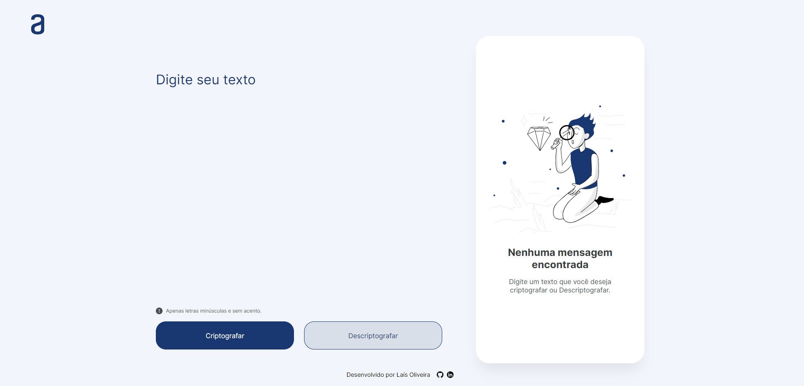
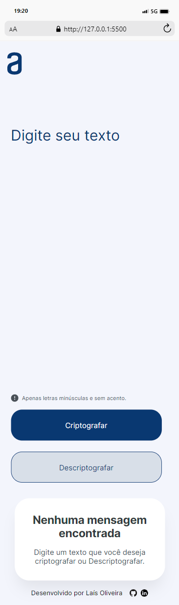

<h1 align="center">
   🔐 | 1º CHALLENGE ONE ORACLE - Turma 5
</h1>

<h4 align="center">
  Site feito para o 1º Desafio do programa ORACLE NEXT EDUCATION (ONE), onde pedia para que fosse feita uma página de criptografia e descriptografia de textos, com botão de copiar. 
</h4>

---

<h3>VERSÃO WEB</h3>

---

<h3>VERSÃO MOBILE</h3>

  

---

## ✅ O site é composto por :

<ul>
  <li> Entrada e saída de Texto;</li>
  <li> Responsividade para telas (min 375px e max 1400px);📱 🖥</li>
  <li> Modo dark (de acordo com a preferência do seu navegador);</li>
  <li> Botão para copiar o seu texto;</li>
  <li>Vlibras para acessibilidade;👐</li>
</ul>

---

## ⚙ Tecnologias utilizadas

- HTML;
- CSS;
- Javascript;

---

## ⚠ Dificuldades durante o projeto

- Aplicar responsividade
- Alinhar elementos com flexbox
- Utilizar DOM (javaScript)
- Funções e validações de texto

---

## 👩 Autor(a) 

  

 Laís Oliveira 

   

